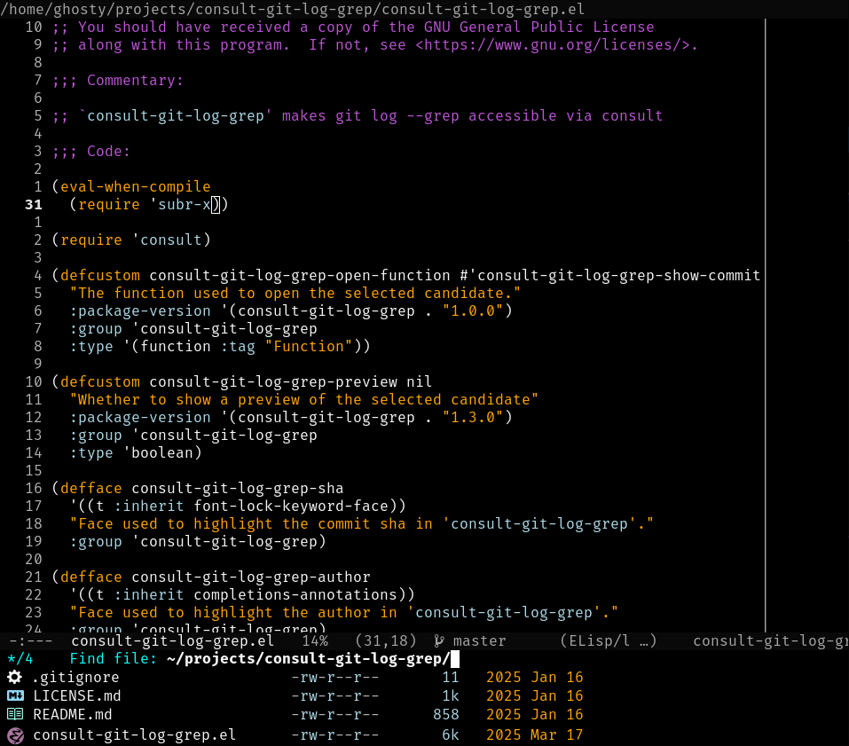
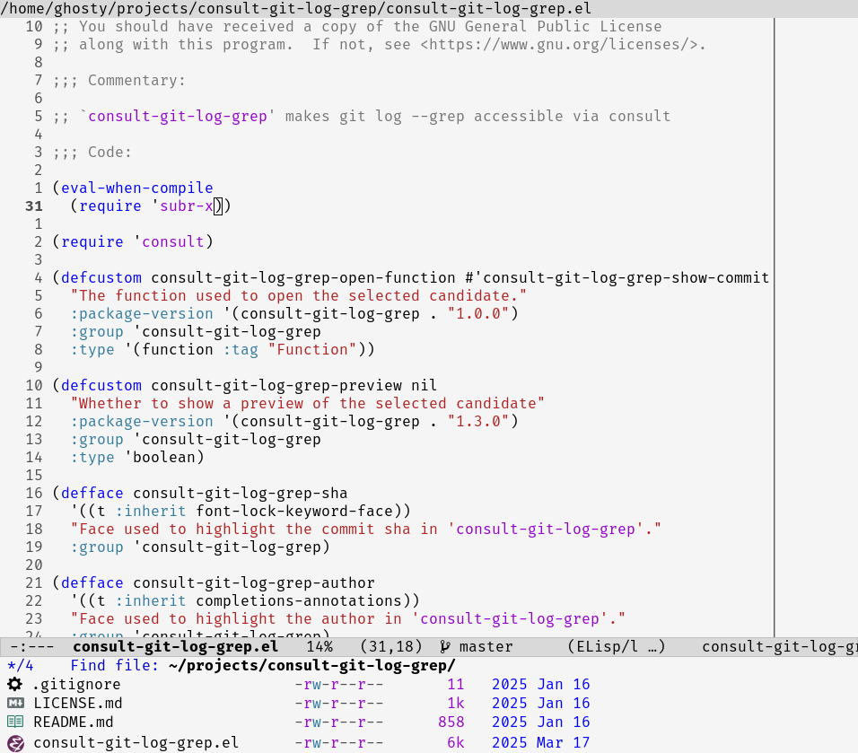

# Ghstly Themes

A pair of dark and light Emacs themes.

## Installation

This package is available on MELPA and can be installed using ```M-x package-install``` or if use-package is installed:

```elisp
(use-package ghstly-themes
  :config
  (load-theme 'ghstly-themes-dark t))
```

## Screenshots

### Dark theme


### Light theme

